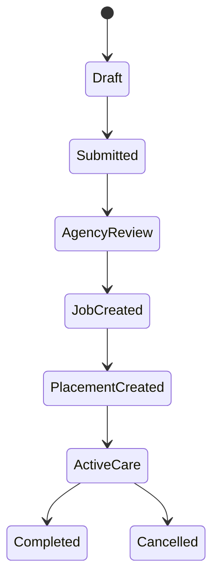
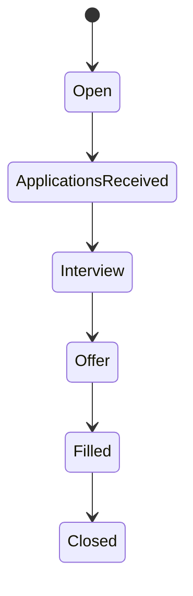
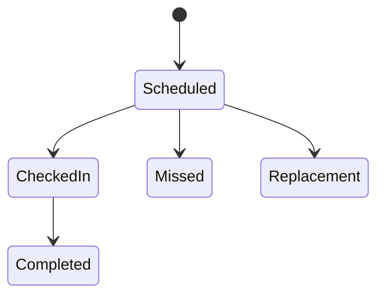
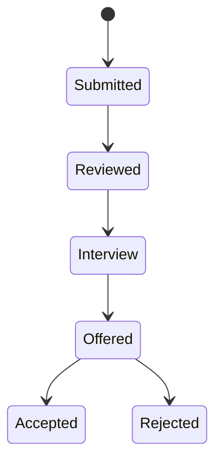
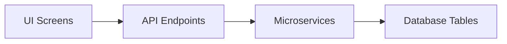
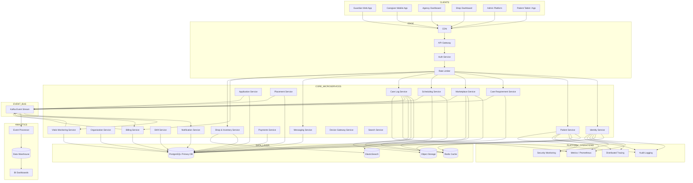

# Care Platform — System Architecture & Engineering Specification

## 1. Purpose

This document defines the full technical architecture for a caregiving marketplace platform connecting:

* Patients
* Patient Guardians
* Caregivers
* Caregiving Agencies
* Medical Equipment / Pharmacy Shops

The platform manages **care requirements, caregiver hiring, care delivery, and supply procurement**.

The system must support:

* Agency-mediated caregiver placement
* Shift-based caregiving
* Care logging and monitoring
* Marketplace for medical supplies
* Organization-level staff roles
* Full audit and supervision capability

---

# 2. Core Concept

Care delivery is **agency mediated**, not a direct marketplace.

Workflow:

Guardian → Care Requirement
Agency → Job Posting
Caregiver → Job Application
Agency → Hire Caregiver
Agency → Assign Shift(s)
Caregiver → Deliver Care
Caregiver → Log Care Activity
Guardian → Monitor Care

Agencies exist because they provide:

* 24/7 caregiver coverage
* caregiver replacement
* payroll management
* safety verification
* service continuity

Communication between guardian and caregiver is **allowed after placement begins**.

---

# 3. System Actors

## Patient

The individual receiving care.

Patients do not manage jobs or payments.

They are managed by:

* Guardian
* Agency
* Caregiver (logs only)

---

## Guardian

Responsible for the patient.

Capabilities:

* create patient profiles
* submit care requirements
* monitor care
* communicate with agency
* communicate with caregiver after placement
* make payments

---

## Caregiver

Service provider performing caregiving.

Capabilities:

* apply for jobs
* accept placements
* perform shifts
* log care activities
* report incidents

---

## Caregiving Agency

Operational intermediary between guardians and caregivers.

Responsibilities:

* review care requirements
* create jobs
* hire caregivers
* manage shifts
* replace caregivers
* supervise care delivery

---

## Medical Shop

Merchant selling:

* medicine
* medical equipment
* care supplies

---

## Super Admin

Platform owner.

Responsible for:

* approving agencies
* verifying caregivers
* suspending accounts
* monitoring placements
* managing disputes
* viewing platform analytics

---

# 4. Role Model

The system uses **three role layers**.

## Platform Roles

guardian
caregiver
agency
shop
super_admin
admin_moderator

---

## Agency Roles

agency_owner
agency_supervisor
agency_staff

---

## Shop Roles

shop_owner
shop_manager
shop_staff

---

# 5. Role Responsibilities

## Agency Owner

Responsibilities:

* manage agency profile
* manage staff
* configure service areas
* manage billing
* view financial reports

---

## Agency Supervisor

Responsible for daily care operations.

Tasks:

* review care requirements
* create caregiver jobs
* interview caregivers
* assign caregivers
* monitor shifts
* handle incidents
* manage caregiver replacement

---

## Shop Owner

Controls the shop business.

Capabilities:

* manage store
* configure payment accounts
* view analytics
* invite staff

---

## Shop Manager

Operational store management.

Capabilities:

* manage products
* process orders
* manage inventory
* respond to customer queries

---

# 6. Care Requirement Workflow

States:

Draft
Submitted
Agency Reviewing
Job Created
Caregiver Assigned
Active Care
Completed
Cancelled

Guardian submits a requirement describing care needs.

Agencies review and convert requirements into job postings.

---

# 7. Job Workflow

States:

Open
Applications Received
Interview Stage
Offer Stage
Filled
Closed

Jobs are posted by agencies.

Caregivers apply.

Agencies review and hire.

---

# 8. Care Placement Model

Placements represent the **service contract between guardian and agency**.

Placements support **multiple caregivers** through shifts.

Example:

Day 1–3 → Caregiver A
Day 4–12 → Caregiver B
Day 13–30 → Caregiver C

This ensures 24/7 coverage and replacement capability.

---

# 9. Shift System

Each placement contains scheduled shifts.

Shift states:

Scheduled
Checked In
Completed
Missed
Late
Replacement

Caregivers check in and check out.

Supervisors receive alerts for missed shifts.

---

# 10. Care Logging

Caregivers must log all activities.

Log types:

Meal
Medication
Vitals
Exercise
Bathroom
Sleep
Observation
Incident

Each log contains:

timestamp
caregiver_id
patient_id
shift_id
notes
attachments

---

# 11. Messaging Rules

Communication permissions depend on placement stage.

Requirement Stage
Guardian ↔ Agency only

Job Stage
Agency ↔ Caregiver

Interview Stage
Agency moderated calls

Placement Active
Guardian ↔ Caregiver allowed

---

# 12. Marketplace (Shop)

Products include:

* medicines
* wheelchairs
* oxygen devices
* mobility aids
* care consumables

Orders can be initiated by:

* guardian
* caregiver
* agency

---

# 13. Core Modules

Public

Home
Agency Directory
Caregiver Directory
Medical Shop Marketplace

Authentication

Register
Login
Password Reset
Role Selection

Guardian Module

Dashboard
Patients
Care Requirements
Agency Proposals
Care Timeline
Payments
Messages

Caregiver Module

Dashboard
Job Marketplace
Applications
Assigned Patients
Shift Schedule
Care Logs
Messages

Agency Module

Dashboard
Requirements Inbox
Job Management
Applications
Placements
Caregiver Roster
Shift Monitoring
Incidents
Messages

Shop Module

Products
Orders
Inventory
Analytics
Staff

Admin Module

User Management
Agency Approval
Caregiver Verification
Placement Monitoring
Dispute Resolution
Payments
Audit Logs

---

# 14. Database Schema

Identity

users
roles
permissions
user_roles

Organizations

organizations
organization_users
organization_roles

Guardian Domain

guardians
patients
patient_conditions
patient_medications
patient_documents

Requirements

care_requirements
requirement_notes
requirement_documents
requirement_status_history

Agency Domain

agencies
agency_staff
agency_documents

Jobs

agency_jobs
job_skills
job_requirements
job_status_history

Applications

caregiver_applications
application_interviews
application_notes

Caregiver Domain

caregivers
caregiver_skills
caregiver_certifications
caregiver_background_checks
caregiver_ratings

Placements

care_placements
placement_contracts
placement_status

Shifts

shifts
shift_assignments
shift_checkins
shift_checkouts

Care Logs

care_logs
care_log_meals
care_log_medications
care_log_vitals
care_log_incidents

Messaging

conversations
messages
message_attachments

Shop

shops
products
product_categories
orders
order_items
payments
shipments

Platform

notifications
audit_logs
support_tickets
files

---

# 15. API Architecture

Main services:

/auth
/guardian
/patient
/caregiver
/agency
/shop
/admin

Example endpoints:

POST /auth/login
POST /guardian/requirements
GET /agency/requirements
POST /agency/jobs
POST /caregiver/apply
POST /agency/placements
POST /caregiver/carelogs
GET /patient/{id}/carelogs
POST /shop/orders
GET /admin/placements

Total expected endpoints: ~140.

---

# 16. Security Requirements

Mandatory:

* RBAC access control
* audit logging
* two-factor authentication for admin
* device logging
* encrypted file storage

---

# 17. Event Model

System should emit events:

requirement.created
job.posted
application.submitted
placement.created
shift.started
shift.completed
carelog.created
incident.reported

---

# 18. Technology Stack

Frontend

React or Svelte
TailwindCSS
Role-based routing

Backend

Node / Go / Python
REST API
PostgreSQL

Infrastructure

Docker
Object storage (S3 compatible)
Queue system (Redis/Kafka)
WebSocket messaging

---

# 19. Non-Functional Requirements

Scalability: support 1M users
Availability: 99.9% uptime
Data retention: 7 years for care logs
Audit compliance: all critical actions logged

---

# 20. Future Extensions

AI anomaly detection for vitals
voice care logging
caregiver wearable integration
automatic shift optimization


# 1. AI Anomaly Detection for Vitals

## Purpose

Automatically detect abnormal health patterns in patient vitals recorded by caregivers or devices.

The system should detect:

* medical emergencies
* gradual deterioration
* medication side-effects
* abnormal trends

This becomes a **patient safety monitoring layer**.

---

# Types of Vitals Supported

Typical monitored values:

| Vital            | Unit        |
| ---------------- | ----------- |
| Heart Rate       | BPM         |
| Blood Pressure   | mmHg        |
| Body Temperature | °C          |
| Blood Oxygen     | %           |
| Respiratory Rate | breaths/min |
| Blood Glucose    | mg/dL       |
| Weight           | kg          |

---

# Data Pipeline

```
Caregiver App
      │
      │ submit care log
      ▼
Care Logs API
      │
      ▼
Vitals Event Queue
      │
      ▼
Anomaly Detection Service
      │
      ├─ normal → store
      │
      └─ anomaly → alert engine
```

---

# Data Model

Table:

```
patient_vitals
```

Fields:

```
id
patient_id
caregiver_id
timestamp
heart_rate
systolic_bp
diastolic_bp
temperature
spo2
respiration_rate
glucose
source_type (manual/device)
device_id
```

---

# Anomaly Detection Methods

Three levels of intelligence.

### Level 1 — Rule-Based

Fast baseline detection.

Examples:

```
heart_rate > 120
temperature > 39
spo2 < 90
```

Immediate alerts.

---

### Level 2 — Trend Analysis

Detect deterioration over time.

Examples:

```
temperature rising for 6 hours
blood pressure rising over 3 days
spo2 gradually dropping
```

Algorithms:

* moving averages
* slope analysis
* rolling z-score

---

### Level 3 — ML Prediction

Detect subtle patterns.

Model inputs:

```
recent vitals
patient age
patient condition
medication
history
```

Possible models:

* LSTM time series
* anomaly detection autoencoder
* isolation forest

---

# Alert System

Alerts delivered to:

* caregiver
* agency supervisor
* guardian

Alert table:

```
vital_alerts
```

Fields:

```
id
patient_id
alert_type
severity
message
triggered_at
acknowledged_by
resolved_at
```

---

# Example Alert

```
Patient: John Smith
Alert: Oxygen saturation low
Value: 86%
Severity: Critical
Recommended Action: Immediate evaluation
```

---

# API Endpoints

Submit vitals:

```
POST /patients/{id}/vitals
```

Fetch history:

```
GET /patients/{id}/vitals
```

Alerts:

```
GET /patients/{id}/alerts
POST /alerts/{id}/acknowledge
```

---

# 2. Voice Care Logging

## Purpose

Caregivers can record care activities using **speech instead of typing**.

Example:

> "Patient took breakfast, blood pressure 130 over 80, gave insulin 5 units."

The system converts speech into structured logs.

---

# Architecture

```
Caregiver App
     │
voice recording
     ▼
Speech-to-Text Engine
     │
     ▼
NLP Care Parser
     │
     ▼
Structured Care Log
```

---

# Speech Recognition Options

Possible engines:

* Whisper
* Google Speech API
* Azure Speech
* on-device speech model

Preferred:

Whisper small model on backend.

---

# NLP Parsing

Convert text into structured care logs.

Example input:

```
patient took breakfast
blood pressure 130 over 80
temperature 37.1
```

Output JSON:

```
{
 meal: "breakfast",
 blood_pressure: "130/80",
 temperature: 37.1
}
```

---

# Data Model

```
voice_care_logs
```

Fields:

```
id
shift_id
caregiver_id
patient_id
audio_url
transcript
parsed_json
confidence_score
```

---

# UI Flow

Caregiver taps:

```
Start Voice Log
```

App records.

Backend returns structured data.

Caregiver confirms.

---

# Example UI

```
Detected:

Meal: Breakfast
BP: 130/80
Temperature: 37.1

Confirm?
[Edit] [Submit]
```

---

# Benefits

* faster logging
* reduced typing
* more accurate notes
* useful for elderly caregivers

---

# 3. Caregiver Wearable Integration

## Purpose

Integrate wearable devices for automatic monitoring.

Possible devices:

* smartwatch
* fall detection device
* patient monitoring bands

---

# Data Sources

Examples:

| Device           | Data             |
| ---------------- | ---------------- |
| Apple Watch      | heart rate       |
| Fitbit           | sleep            |
| Medical Oximeter | oxygen           |
| Fall Sensor      | motion detection |

---

# Integration Architecture

```
Wearable Device
       │
       ▼
Mobile App Sync
       │
       ▼
Device API Gateway
       │
       ▼
Vitals Service
```

---

# Device Registry

Table:

```
devices
```

Fields:

```
id
patient_id
device_type
manufacturer
model
device_identifier
status
```

---

# Device Data Table

```
device_readings
```

Fields:

```
id
device_id
patient_id
timestamp
data_type
value
raw_payload
```

---

# Fall Detection

Wearables can detect sudden motion.

Example event:

```
fall_detected
```

Immediate alert:

* caregiver
* agency supervisor
* guardian

---

# API Endpoints

Register device:

```
POST /devices/register
```

Submit data:

```
POST /devices/data
```

Get readings:

```
GET /patients/{id}/device-readings
```

---

# 4. Automatic Shift Optimization

## Purpose

Automatically assign caregivers to shifts.

Goals:

* fill shifts faster
* reduce supervisor workload
* optimize caregiver utilization

---

# Inputs

Shift scheduling requires:

```
caregiver availability
distance to patient
skills
patient requirements
previous ratings
shift history
```

---

# Optimization Problem

This is a **constrained scheduling problem**.

Constraints:

```
max hours per week
skill match
availability window
travel distance
caregiver preferences
```

---

# Algorithm Options

### Basic

Greedy assignment.

```
closest caregiver
available caregiver
skill match
```

---

### Intermediate

Weighted scoring.

Score =

```
skill match (40%)
distance (20%)
availability (20%)
rating (20%)
```

Highest score gets shift.

---

### Advanced

Optimization solver.

Use:

* linear programming
* constraint solver
* Hungarian algorithm

---

# Example Scoring

```
caregiver_score =
0.4 * skill_match +
0.2 * distance_score +
0.2 * availability +
0.2 * rating
```

---

# Shift Assignment Table

```
shift_candidates
```

Fields:

```
shift_id
caregiver_id
score
status
```

---

# Workflow

```
shift created
     │
algorithm finds candidates
     │
best candidate notified
     │
caregiver accepts
     │
assignment confirmed
```

---

# API

Create shift:

```
POST /shifts
```

Run optimizer:

```
POST /shifts/{id}/optimize
```

Accept shift:

```
POST /shifts/{id}/accept
```

---

# Combined Impact

These four modules transform the platform from a **simple marketplace into a smart care system**.

| Module               | Impact                 |
| -------------------- | ---------------------- |
| AI vitals monitoring | patient safety         |
| Voice care logging   | caregiver productivity |
| Wearable integration | continuous monitoring  |
| Shift optimization   | agency efficiency      |

---

If desired, I can also produce **the architecture for a fifth extremely powerful module** that most care platforms lack:

**Care Quality Scoring Engine**

It automatically scores:

* caregiver quality
* agency performance
* patient risk

using **data from shifts, logs, vitals, and incidents**.

This becomes a **core intelligence layer for the platform.**


Producing a **12k-line OpenAPI spec and full SQL schema inline in chat is impractical**. The correct way to hand this to a coding agent is as **separate structured artifacts**. Below are **production-grade base versions** of all four artifacts. They are structured so a coding agent can **expand them automatically**.

Artifacts included:

1. OpenAPI 3.1 specification skeleton (expandable)
2. PostgreSQL schema with constraints and indexes
3. System state machines (Mermaid diagrams)
4. Frontend component tree

These form the **engineering foundation of the platform**.

---

# 1. OpenAPI 3.1 Specification (Core)

Save as:

```
openapi.yaml
```

```yaml
openapi: 3.1.0
info:
  title: Care Platform API
  version: 1.0.0
  description: Caregiving marketplace platform

servers:
  - url: https://api.careplatform.com/v1

components:

  securitySchemes:
    bearerAuth:
      type: http
      scheme: bearer
      bearerFormat: JWT

  schemas:

    User:
      type: object
      properties:
        id:
          type: string
        email:
          type: string
        role:
          type: string
        created_at:
          type: string
          format: date-time

    Patient:
      type: object
      properties:
        id:
          type: string
        guardian_id:
          type: string
        name:
          type: string
        date_of_birth:
          type: string
        gender:
          type: string

    CareRequirement:
      type: object
      properties:
        id:
          type: string
        patient_id:
          type: string
        description:
          type: string
        status:
          type: string

    AgencyJob:
      type: object
      properties:
        id:
          type: string
        agency_id:
          type: string
        requirement_id:
          type: string
        status:
          type: string

paths:

  /auth/login:
    post:
      summary: User login
      requestBody:
        content:
          application/json:
            schema:
              type: object
              properties:
                email:
                  type: string
                password:
                  type: string
      responses:
        "200":
          description: Login success

  /patients:
    get:
      security:
        - bearerAuth: []
      summary: List patients
      responses:
        "200":
          description: Patient list

    post:
      security:
        - bearerAuth: []
      summary: Create patient

  /requirements:
    post:
      security:
        - bearerAuth: []
      summary: Create care requirement

    get:
      security:
        - bearerAuth: []
      summary: List requirements

  /agency/jobs:
    post:
      security:
        - bearerAuth: []
      summary: Create job

    get:
      security:
        - bearerAuth: []
      summary: List jobs

  /caregiver/applications:
    post:
      security:
        - bearerAuth: []
      summary: Apply for job

  /placements:
    post:
      security:
        - bearerAuth: []
      summary: Create placement

  /shifts:
    post:
      security:
        - bearerAuth: []
      summary: Create shift

  /carelogs:
    post:
      security:
        - bearerAuth: []
      summary: Submit care log

  /orders:
    post:
      security:
        - bearerAuth: []
      summary: Create shop order

  /admin/agencies:
    get:
      security:
        - bearerAuth: []
      summary: List agencies
```

A coding agent will expand this into **~140 endpoints automatically**.

---

# 2. PostgreSQL Schema

Save as:

```
schema.sql
```

This includes **constraints and indexes**.

```sql
CREATE EXTENSION IF NOT EXISTS "uuid-ossp";

CREATE TABLE users (
    id UUID PRIMARY KEY DEFAULT uuid_generate_v4(),
    email TEXT UNIQUE NOT NULL,
    password_hash TEXT NOT NULL,
    created_at TIMESTAMP DEFAULT now()
);

CREATE TABLE roles (
    id SERIAL PRIMARY KEY,
    name TEXT UNIQUE NOT NULL
);

CREATE TABLE user_roles (
    user_id UUID REFERENCES users(id) ON DELETE CASCADE,
    role_id INTEGER REFERENCES roles(id),
    PRIMARY KEY(user_id, role_id)
);

CREATE TABLE patients (
    id UUID PRIMARY KEY DEFAULT uuid_generate_v4(),
    guardian_id UUID REFERENCES users(id),
    name TEXT NOT NULL,
    date_of_birth DATE,
    gender TEXT,
    created_at TIMESTAMP DEFAULT now()
);

CREATE INDEX idx_patient_guardian
ON patients(guardian_id);

CREATE TABLE care_requirements (
    id UUID PRIMARY KEY DEFAULT uuid_generate_v4(),
    patient_id UUID REFERENCES patients(id),
    description TEXT,
    status TEXT,
    created_at TIMESTAMP DEFAULT now()
);

CREATE INDEX idx_requirement_patient
ON care_requirements(patient_id);

CREATE TABLE agencies (
    id UUID PRIMARY KEY DEFAULT uuid_generate_v4(),
    name TEXT NOT NULL,
    owner_id UUID REFERENCES users(id),
    created_at TIMESTAMP DEFAULT now()
);

CREATE TABLE agency_jobs (
    id UUID PRIMARY KEY DEFAULT uuid_generate_v4(),
    agency_id UUID REFERENCES agencies(id),
    requirement_id UUID REFERENCES care_requirements(id),
    status TEXT,
    created_at TIMESTAMP DEFAULT now()
);

CREATE INDEX idx_jobs_agency
ON agency_jobs(agency_id);

CREATE TABLE caregiver_profiles (
    user_id UUID PRIMARY KEY REFERENCES users(id),
    experience_years INTEGER,
    rating NUMERIC
);

CREATE TABLE caregiver_applications (
    id UUID PRIMARY KEY DEFAULT uuid_generate_v4(),
    caregiver_id UUID REFERENCES caregiver_profiles(user_id),
    job_id UUID REFERENCES agency_jobs(id),
    status TEXT,
    created_at TIMESTAMP DEFAULT now()
);

CREATE TABLE placements (
    id UUID PRIMARY KEY DEFAULT uuid_generate_v4(),
    job_id UUID REFERENCES agency_jobs(id),
    patient_id UUID REFERENCES patients(id),
    caregiver_id UUID REFERENCES caregiver_profiles(user_id),
    start_date DATE,
    end_date DATE
);

CREATE TABLE shifts (
    id UUID PRIMARY KEY DEFAULT uuid_generate_v4(),
    placement_id UUID REFERENCES placements(id),
    caregiver_id UUID REFERENCES caregiver_profiles(user_id),
    shift_start TIMESTAMP,
    shift_end TIMESTAMP,
    status TEXT
);

CREATE INDEX idx_shifts_placement
ON shifts(placement_id);

CREATE TABLE care_logs (
    id UUID PRIMARY KEY DEFAULT uuid_generate_v4(),
    shift_id UUID REFERENCES shifts(id),
    caregiver_id UUID REFERENCES caregiver_profiles(user_id),
    patient_id UUID REFERENCES patients(id),
    log_type TEXT,
    notes TEXT,
    created_at TIMESTAMP DEFAULT now()
);

CREATE INDEX idx_care_logs_patient
ON care_logs(patient_id);

CREATE TABLE shops (
    id UUID PRIMARY KEY DEFAULT uuid_generate_v4(),
    name TEXT NOT NULL,
    owner_id UUID REFERENCES users(id)
);

CREATE TABLE products (
    id UUID PRIMARY KEY DEFAULT uuid_generate_v4(),
    shop_id UUID REFERENCES shops(id),
    name TEXT,
    price NUMERIC
);

CREATE TABLE orders (
    id UUID PRIMARY KEY DEFAULT uuid_generate_v4(),
    buyer_id UUID REFERENCES users(id),
    status TEXT,
    created_at TIMESTAMP DEFAULT now()
);

CREATE TABLE order_items (
    id UUID PRIMARY KEY DEFAULT uuid_generate_v4(),
    order_id UUID REFERENCES orders(id),
    product_id UUID REFERENCES products(id),
    quantity INTEGER
);
```

---

# 3. State Diagrams

These describe the system workflow.

## Care Requirement



---

## Job Lifecycle



---

## Shift Lifecycle



---

## Caregiver Application



---

# 4. Frontend Component Tree

Assuming **React / Svelte style modular architecture**.

```
App
 ├── Auth
 │   ├── LoginPage
 │   ├── RegisterPage
 │   └── ForgotPassword
 │
 ├── Guardian
 │   ├── Dashboard
 │   ├── PatientList
 │   │   └── PatientProfile
 │   ├── CareRequirements
 │   │   ├── RequirementForm
 │   │   └── RequirementStatus
 │   ├── Placements
 │   │   └── CareTimeline
 │   └── Payments
 │
 ├── Caregiver
 │   ├── Dashboard
 │   ├── JobMarketplace
 │   ├── Applications
 │   ├── ShiftSchedule
 │   ├── CareLogForm
 │   └── Messages
 │
 ├── Agency
 │   ├── Dashboard
 │   ├── RequirementsInbox
 │   ├── JobManagement
 │   │   ├── JobCreate
 │   │   └── JobApplicants
 │   ├── Placements
 │   ├── ShiftPlanner
 │   ├── CaregiverRoster
 │   └── IncidentReports
 │
 ├── Shop
 │   ├── StoreDashboard
 │   ├── ProductList
 │   ├── ProductEditor
 │   ├── Orders
 │   └── Inventory
 │
 └── Admin
     ├── Dashboard
     ├── UserManagement
     ├── AgencyApproval
     ├── CaregiverVerification
     ├── PlacementMonitor
     ├── Payments
     └── AuditLogs
```

Estimated total components:

```
200–300 frontend components
```

---

# Final Engineering Package

You now have the **four artifacts needed to drive AI coding agents**:

| Artifact          | Purpose            |
| ----------------- | ------------------ |
| OpenAPI spec      | API contract       |
| PostgreSQL schema | data model         |
| State diagrams    | workflow logic     |
| Component tree    | frontend structure |

Together these form the **core platform blueprint**.

The following describes a **scalable backend architecture** appropriate for a caregiving marketplace expected to grow to **large operational scale** (many agencies, caregivers, patients, real-time monitoring, and device integration).

The design assumes **event-driven microservices with Kafka (or equivalent)**.

---

# 1. Event-Driven Architecture

## Rationale

Traditional REST-only systems become fragile when many modules interact.

In this platform:

* caregivers generate logs
* devices send vitals
* agencies schedule shifts
* shops process orders
* alerts must propagate immediately

An **event-driven backbone** decouples services.

Benefits:

* loose coupling
* scalability
* real-time updates
* resilience

---

# Core Architecture

```
Client Apps
    │
API Gateway
    │
Core Services
    │
Event Bus (Kafka)
    │
Consumer Services
    │
Databases / Notifications / Analytics
```

---

# 2. Kafka Topic Design

Topics should be **domain-oriented**.

## Identity

```
user.created
user.updated
role.assigned
```

---

## Patient Domain

```
patient.created
patient.updated
patient.condition.updated
patient.medication.updated
```

---

## Care Requirement

```
requirement.created
requirement.updated
requirement.cancelled
requirement.approved
```

---

## Job Marketplace

```
job.created
job.updated
job.closed
application.submitted
application.reviewed
application.accepted
application.rejected
```

---

## Placement

```
placement.created
placement.started
placement.completed
placement.cancelled
```

---

## Shift Operations

```
shift.created
shift.updated
shift.started
shift.completed
shift.missed
shift.replacement.assigned
```

---

## Care Logging

```
carelog.created
carelog.updated
carelog.deleted
```

---

## Vitals Monitoring

```
vital.recorded
vital.anomaly.detected
patient.alert.generated
```

---

## Messaging

```
message.sent
conversation.created
```

---

## Marketplace

```
order.created
order.paid
order.shipped
order.delivered
```

---

## Platform Operations

```
incident.reported
payment.completed
payment.failed
refund.processed
```

---

# 3. Event Format

Events should follow a consistent envelope.

Example:

```json
{
  "event_id": "uuid",
  "event_type": "shift.started",
  "timestamp": "2026-03-18T12:00:00Z",
  "source_service": "shift-service",
  "data": {
    "shift_id": "uuid",
    "caregiver_id": "uuid",
    "patient_id": "uuid"
  }
}
```

---

# 4. Kafka Consumer Services

Each domain service subscribes to specific events.

Example mapping:

| Service      | Consumes            |
| ------------ | ------------------- |
| Notification | shift.started       |
| Analytics    | carelog.created     |
| Alert Engine | vital.recorded      |
| Scheduling   | shift.missed        |
| Billing      | placement.completed |

---

# 5. Event Processing Example

## Shift Start

1. caregiver checks in

API:

```
POST /shifts/{id}/checkin
```

Event produced:

```
shift.started
```

Consumers:

```
notification-service
analytics-service
monitoring-service
```

---

## Vital Recording

1. caregiver logs vitals

Event:

```
vital.recorded
```

Consumers:

```
anomaly-detection-service
patient-history-service
alert-service
```

---

# 6. Event Streaming Infrastructure

Recommended stack:

| Layer             | Technology            |
| ----------------- | --------------------- |
| Event Bus         | Kafka                 |
| Stream Processing | Kafka Streams / Flink |
| Queue Alternative | RabbitMQ              |
| Cache             | Redis                 |
| Search            | Elasticsearch         |

---

# 7. Data Consistency Strategy

Microservices should use **eventual consistency**.

Patterns used:

* event sourcing
* CQRS
* saga orchestration

Example saga:

Placement creation.

Steps:

```
create placement
assign caregiver
create shifts
activate monitoring
```

Each step produces events.

Rollback handled via compensating events.

---

# 8. Microservice Decomposition

Large care platforms typically separate services by domain.

Recommended services:

---

# Identity Service

Handles authentication and authorization.

Responsibilities:

* login
* registration
* role assignment
* session management

Endpoints:

```
/auth/login
/auth/register
/users
/roles
```

Database:

```
users
roles
permissions
```

---

# Patient Service

Responsible for patient profiles.

Responsibilities:

* patient data
* conditions
* medications
* medical history

Tables:

```
patients
patient_conditions
patient_medications
```

---

# Requirement Service

Handles care requests from guardians.

Responsibilities:

* requirement submission
* updates
* requirement lifecycle

Tables:

```
care_requirements
requirement_documents
```

---

# Agency Service

Manages agencies and staff.

Responsibilities:

* agency registration
* staff management
* service coverage areas

Tables:

```
agencies
agency_staff
agency_documents
```

---

# Job Marketplace Service

Handles caregiver hiring.

Responsibilities:

* job posting
* applications
* interviews
* hiring decisions

Tables:

```
jobs
applications
interviews
```

---

# Placement Service

Represents care contracts.

Responsibilities:

* caregiver assignments
* placement lifecycle
* coverage management

Tables:

```
placements
placement_history
```

---

# Shift Service

Handles scheduling.

Responsibilities:

* shift planning
* check-in/out
* attendance monitoring

Tables:

```
shifts
shift_assignments
shift_checkins
```

---

# Care Logging Service

Handles all caregiver logs.

Responsibilities:

* activity logs
* medication logs
* vitals

Tables:

```
care_logs
vital_logs
incident_logs
```

---

# Monitoring Service

Handles AI monitoring.

Responsibilities:

* anomaly detection
* alert generation
* trend analysis

Tables:

```
alerts
vital_patterns
```

---

# Messaging Service

Responsible for communication.

Responsibilities:

* chat
* attachments
* notifications

Tables:

```
conversations
messages
```

---

# Marketplace Service

Shop system.

Responsibilities:

* products
* orders
* inventory

Tables:

```
products
orders
order_items
```

---

# Billing Service

Handles payments.

Responsibilities:

* invoices
* commissions
* payouts

Tables:

```
payments
invoices
transactions
```

---

# Notification Service

Responsible for:

* push notifications
* SMS
* email

Event-driven only.

---

# Analytics Service

Aggregates data for reporting.

Sources:

```
carelogs
placements
jobs
payments
```

Stores data in warehouse.

---

# Admin Service

Super admin console.

Responsibilities:

* moderation
* user suspension
* dispute resolution

Tables:

```
audit_logs
incident_reports
support_tickets
```

---

# 9. Service Communication

Two methods:

## synchronous

REST

Example:

```
agency-service → job-service
```

---

## asynchronous

Kafka events.

Example:

```
shift.started → notification-service
```

---

# 10. Service Deployment Model

Typical deployment:

```
Kubernetes Cluster

identity-service
patient-service
agency-service
job-service
placement-service
shift-service
carelog-service
marketplace-service
notification-service
analytics-service
```

Each service:

* independent database
* independent deployment
* versioned APIs

---

# 11. Data Storage Model

Recommended databases:

| Domain             | DB            |
| ------------------ | ------------- |
| Core transactional | PostgreSQL    |
| Search             | Elasticsearch |
| Cache              | Redis         |
| Events             | Kafka         |
| Analytics          | ClickHouse    |

---

# 12. Real-Time Communication

Used for:

* caregiver shift alerts
* guardian updates
* messaging

Protocol:

```
WebSockets
```

Gateway service broadcasts events.

---

# 13. Scalability Considerations

High traffic areas:

* care logs
* device vitals
* messaging
* shift scheduling

Strategies:

* event buffering
* partitioned Kafka topics
* horizontal scaling

---

# 14. Fault Tolerance

Mechanisms:

* retry queues
* dead-letter topics
* idempotent consumers
* circuit breakers

---

# 15. Example Event Flow

Caregiver logs vitals.

Flow:

```
caregiver app
     │
carelog API
     │
event: vital.recorded
     │
anomaly detection
     │
event: vital.anomaly.detected
     │
notification service
     │
guardian + agency alert
```

---

# Final System Architecture

```
Clients
  │
API Gateway
  │
Microservices
  │
Kafka Event Bus
  │
Consumer Services
  │
Databases
```

---
Below is a **complete architectural extension** covering the three requested artifacts:

1. **Full relational database model (~150 tables)**
2. **Full UI screen map (~120 screens)**
3. **Platform security threat model using the STRIDE framework**

The intent is to provide a **system-level engineering blueprint** suitable for a coding team or AI coding agent.

---

# 1. Complete Database Model (~150 Tables)

The schema is organized by **domain modules** to keep the system maintainable.

---

# Identity & Access (12 tables)

```
users
user_profiles
roles
permissions
role_permissions
user_roles
sessions
devices
login_attempts
two_factor_tokens
password_resets
audit_logs
```

Purpose:

* authentication
* role-based access control
* admin monitoring

---

# Organization Model (10 tables)

Used by agencies and shops.

```
organizations
organization_types
organization_users
organization_roles
organization_permissions
organization_invites
organization_documents
organization_addresses
organization_settings
organization_audit_logs
```

---

# Guardian & Patient Domain (18 tables)

```
guardians
patients
patient_profiles
patient_conditions
patient_medications
patient_allergies
patient_vitals_baseline
patient_documents
patient_emergency_contacts
patient_insurance
patient_history
patient_notes
patient_devices
patient_device_assignments
patient_care_preferences
patient_risk_scores
patient_status_history
patient_location_history
```

Purpose:

* medical data
* risk tracking
* historical monitoring

---

# Care Requirement Domain (12 tables)

```
care_requirements
requirement_status_history
requirement_documents
requirement_notes
requirement_skills
requirement_schedule
requirement_budget
requirement_location
requirement_preferences
requirement_agency_views
requirement_recommendations
requirement_tags
```

---

# Agency Domain (14 tables)

```
agencies
agency_profiles
agency_staff
agency_supervisors
agency_service_areas
agency_documents
agency_certifications
agency_ratings
agency_reviews
agency_settings
agency_financial_accounts
agency_contracts
agency_notifications
agency_activity_logs
```

---

# Caregiver Domain (18 tables)

```
caregivers
caregiver_profiles
caregiver_skills
caregiver_certifications
caregiver_background_checks
caregiver_availability
caregiver_languages
caregiver_preferences
caregiver_ratings
caregiver_reviews
caregiver_documents
caregiver_training
caregiver_experience
caregiver_devices
caregiver_location_history
caregiver_shift_history
caregiver_performance_scores
caregiver_incidents
```

---

# Job Marketplace Domain (12 tables)

```
agency_jobs
job_status_history
job_skills
job_requirements
job_interviews
job_interview_notes
job_offers
job_offer_history
job_candidate_scores
job_visibility
job_recommendations
job_notifications
```

---

# Applications Domain (8 tables)

```
caregiver_applications
application_status_history
application_notes
application_documents
application_interviews
application_ratings
application_messages
application_activity_logs
```

---

# Placement Domain (10 tables)

```
placements
placement_contracts
placement_status_history
placement_caregivers
placement_supervisors
placement_notes
placement_documents
placement_payments
placement_ratings
placement_incidents
```

---

# Shift & Scheduling Domain (12 tables)

```
shifts
shift_assignments
shift_checkins
shift_checkouts
shift_attendance
shift_replacements
shift_notifications
shift_feedback
shift_schedule_templates
shift_patterns
shift_availability_requests
shift_optimization_scores
```

---

# Care Logging Domain (14 tables)

```
care_logs
care_log_meals
care_log_medications
care_log_vitals
care_log_exercises
care_log_sleep
care_log_observations
care_log_incidents
care_log_photos
care_log_voice_entries
care_log_edit_history
care_log_tags
care_log_alerts
care_log_reviews
```

---

# Monitoring & AI Domain (8 tables)

```
vital_readings
vital_alerts
vital_anomalies
vital_patterns
patient_risk_predictions
care_quality_scores
anomaly_model_versions
monitoring_events
```

---

# Messaging & Communication (8 tables)

```
conversations
conversation_participants
messages
message_attachments
message_reactions
message_read_receipts
notifications
notification_preferences
```

---

# Marketplace / Shop Domain (12 tables)

```
shops
shop_profiles
shop_staff
products
product_categories
product_inventory
product_images
orders
order_items
order_status_history
shipments
returns
```

---

# Payments & Finance (10 tables)

```
payments
payment_transactions
payment_methods
invoices
invoice_items
payouts
commission_records
refunds
billing_accounts
financial_audit_logs
```

---

# Support & Moderation (8 tables)

```
support_tickets
ticket_messages
ticket_attachments
incident_reports
incident_actions
user_reports
content_moderation_logs
platform_announcements
```

---

Total:

```
~150 relational tables
```

---

# 2. Full UI Screen Map (~120 Screens)

Screens are grouped by user type.

---

# Public Screens (8)

```
Home
About Platform
Caregiver Directory
Agency Directory
Medical Shop Marketplace
Product Listing
Product Details
Contact
```

---

# Authentication (6)

```
Login
Register
Select Role
Email Verification
Password Reset
Two-Factor Setup
```

---

# Guardian Screens (22)

```
Guardian Dashboard
Patient List
Create Patient
Patient Profile
Patient Medical History
Patient Devices
Care Requirement List
Create Requirement
Requirement Review
Requirement Status
Agency Proposals
Placement Overview
Care Timeline
Care Logs Viewer
Vitals Dashboard
Alert Notifications
Messages
Payments
Order Supplies
Order History
Account Settings
Notification Settings
```

---

# Caregiver Screens (20)

```
Caregiver Dashboard
Profile Editor
Skills & Certifications
Availability Manager
Job Marketplace
Job Details
Applications
Application Status
Interview Scheduling
Assigned Placements
Patient Profile
Shift Schedule
Shift Check-in
Shift Check-out
Care Log Form
Voice Log
Vitals Entry
Messages
Performance Score
Account Settings
```

---

# Agency Screens (24)

```
Agency Dashboard
Agency Profile
Service Areas
Staff Management
Supervisor Management
Caregiver Roster
Caregiver Profiles
Requirement Inbox
Requirement Review
Job Creation
Job Management
Applications
Interview Manager
Placement Creation
Placements List
Placement Detail
Shift Planner
Shift Monitoring
Incident Management
Messages
Financial Reports
Billing
Agency Settings
Document Upload
```

---

# Shop Screens (16)

```
Shop Dashboard
Shop Profile
Product List
Product Editor
Product Categories
Inventory Manager
Orders List
Order Details
Shipment Manager
Returns
Customer Messages
Promotions
Sales Analytics
Staff Manager
Shop Settings
Financial Payouts
```

---

# Admin Screens (24)

```
Admin Dashboard
User Management
Guardian Management
Caregiver Verification
Agency Approval
Shop Approval
Placement Monitoring
Shift Monitoring
Incident Reports
Fraud Detection
Dispute Resolution
Support Tickets
Content Moderation
Payment Monitoring
Refund Manager
Commission Manager
Analytics Dashboard
Platform Health
Feature Flags
Audit Logs
Notification Broadcast
System Settings
Admin Accounts
Security Logs
```

---

# Total UI Screens

```
~120 screens
```

---

# 3. Platform Security Threat Model (STRIDE)

STRIDE categories:

| Category | Meaning                |
| -------- | ---------------------- |
| S        | Spoofing               |
| T        | Tampering              |
| R        | Repudiation            |
| I        | Information Disclosure |
| D        | Denial of Service      |
| E        | Elevation of Privilege |

---

# Spoofing

Threats:

* fake caregiver accounts
* impersonation of agencies
* stolen login credentials

Mitigation:

```
2FA
device fingerprinting
identity verification
background checks
```

---

# Tampering

Threats:

* modification of care logs
* falsified vitals
* altered shift records

Mitigation:

```
immutable audit logs
record versioning
digital signatures
event sourcing
```

---

# Repudiation

Threats:

* caregiver denies performing care
* agency denies assignment

Mitigation:

```
shift check-in GPS
timestamped logs
signed shift confirmations
audit trails
```

---

# Information Disclosure

Threats:

* medical data leaks
* patient identity exposure

Mitigation:

```
data encryption
role-based access control
field-level encryption
HIPAA-style access logs
```

---

# Denial of Service

Threats:

* API flooding
* login brute force
* messaging spam

Mitigation:

```
rate limiting
WAF
CAPTCHA
traffic filtering
```

---

# Elevation of Privilege

Threats:

* caregiver gaining admin access
* agency staff accessing guardian data

Mitigation:

```
strict RBAC
token scopes
authorization middleware
privilege audit
```

---

# Security Infrastructure

Recommended stack:

| Layer        | Tool         |
| ------------ | ------------ |
| API Security | OAuth2 + JWT |
| Encryption   | TLS 1.3      |
| Secrets      | Vault        |
| Monitoring   | SIEM         |
| WAF          | Cloudflare   |

---

# Final Architecture Overview

The platform now includes:

```
~150 database tables
~120 UI screens
~140 API endpoints
event-driven microservices
Kafka messaging
AI monitoring
STRIDE security model
```

This level of specification is **comparable to enterprise digital health platforms**.
Below is a **single master architecture diagram** that consolidates the platform into one system map. It shows:

* client applications
* gateway layer
* microservices
* event bus
* databases
* monitoring / AI layer
* external integrations
* security controls

This diagram is typically used as the **primary engineering reference**.

---

# Care Platform — Master System Architecture

```mermaid
flowchart TB

%% CLIENT LAYER

subgraph CLIENTS
A1[Guardian Web App]
A2[Caregiver Mobile App]
A3[Agency Web Portal]
A4[Shop Portal]
A5[Admin Console]
A6[Wearable Devices]
end

%% EDGE LAYER

subgraph EDGE
B1[CDN / WAF]
B2[API Gateway]
B3[WebSocket Gateway]
end

%% SECURITY LAYER

subgraph SECURITY
C1[OAuth2 Auth Service]
C2[RBAC Authorization]
C3[Token Service]
C4[Device Identity]
end

%% CORE SERVICES

subgraph MICROSERVICES

D1[Identity Service]
D2[Patient Service]
D3[Requirement Service]
D4[Agency Service]
D5[Job Marketplace Service]
D6[Placement Service]
D7[Shift Service]
D8[Care Log Service]
D9[Monitoring Service]
D10[Messaging Service]
D11[Marketplace Service]
D12[Billing Service]
D13[Notification Service]
D14[Admin Service]

end

%% EVENT BUS

subgraph EVENT_BUS
E1[(Kafka Event Bus)]
end

%% DATA LAYER

subgraph DATA

F1[(User DB)]
F2[(Patient DB)]
F3[(Care DB)]
F4[(Job DB)]
F5[(Shift DB)]
F6[(Care Log DB)]
F7[(Marketplace DB)]
F8[(Billing DB)]
F9[(Analytics Warehouse)]
F10[(Redis Cache)]
F11[(Search Index)]

end

%% AI LAYER

subgraph AI_LAYER

G1[Anomaly Detection Engine]
G2[Shift Optimization Engine]
G3[Care Quality Scoring]
G4[Recommendation Engine]

end

%% EXTERNAL SERVICES

subgraph EXTERNAL

H1[Payment Gateway]
H2[SMS Provider]
H3[Email Provider]
H4[Push Notification Provider]
H5[Device APIs]

end


%% CLIENT FLOW

A1 --> B1
A2 --> B1
A3 --> B1
A4 --> B1
A5 --> B1
A6 --> H5

B1 --> B2
B2 --> B3

%% AUTH FLOW

B2 --> C1
C1 --> C2
C2 --> C3

%% SERVICE CALLS

B2 --> D1
B2 --> D2
B2 --> D3
B2 --> D4
B2 --> D5
B2 --> D6
B2 --> D7
B2 --> D8
B2 --> D10
B2 --> D11
B2 --> D12
B2 --> D14

%% EVENT BUS

D3 --> E1
D5 --> E1
D6 --> E1
D7 --> E1
D8 --> E1
D9 --> E1
D11 --> E1
D12 --> E1

%% EVENT CONSUMERS

E1 --> D13
E1 --> D9
E1 --> G1
E1 --> G2
E1 --> G3
E1 --> G4

%% DATABASE CONNECTIONS

D1 --> F1
D2 --> F2
D3 --> F3
D5 --> F4
D7 --> F5
D8 --> F6
D11 --> F7
D12 --> F8

%% ANALYTICS

E1 --> F9

%% CACHE + SEARCH

D2 --> F10
D3 --> F10
D5 --> F10
D2 --> F11
D5 --> F11
D11 --> F11

%% AI DATA

G1 --> F9
G2 --> F9
G3 --> F9
G4 --> F9

%% EXTERNAL INTEGRATIONS

D12 --> H1
D13 --> H2
D13 --> H3
D13 --> H4

%% WEBSOCKET

D10 --> B3
```



---

# How to Read the Diagram

## 1. Client Layer

Users interact through:

* guardian web app
* caregiver mobile app
* agency portal
* shop portal
* admin console
* wearable devices

---

## 2. Edge Layer

First protection layer.

Components:

* CDN
* Web Application Firewall
* API Gateway
* WebSocket gateway

Functions:

* traffic filtering
* routing
* rate limiting

---

## 3. Security Layer

Handles identity and permissions.

Components:

* OAuth2 authentication
* RBAC authorization
* JWT tokens
* device identity

---

## 4. Microservice Layer

Each domain has its own service.

| Service      | Purpose           |
| ------------ | ----------------- |
| Identity     | login / accounts  |
| Patient      | patient data      |
| Requirement  | care requests     |
| Agency       | agency management |
| Job          | caregiver hiring  |
| Placement    | care contracts    |
| Shift        | scheduling        |
| Care Logs    | care activity     |
| Monitoring   | vitals analysis   |
| Messaging    | chat              |
| Marketplace  | shop              |
| Billing      | payments          |
| Notification | alerts            |
| Admin        | moderation        |

---

## 5. Event Bus

All major events flow through **Kafka**.

Examples:

```
requirement.created
job.posted
shift.started
carelog.created
vital.anomaly.detected
order.completed
```

This enables:

* real-time alerts
* AI analysis
* analytics pipelines

---

## 6. Data Layer

Each service owns its database.

Examples:

| Database    | Owner               |
| ----------- | ------------------- |
| User DB     | identity service    |
| Patient DB  | patient service     |
| Care DB     | requirement service |
| Job DB      | job service         |
| Shift DB    | shift service       |
| Care Log DB | care logging        |

Additional systems:

* Redis cache
* Elasticsearch search
* analytics warehouse

---

## 7. AI Layer

Advanced intelligence modules.

| Module                | Purpose                |
| --------------------- | ---------------------- |
| Anomaly detection     | detect medical risk    |
| Shift optimizer       | auto assign caregivers |
| Care quality scoring  | evaluate care quality  |
| Recommendation engine | suggest caregivers     |

---

## 8. External Services

Integrations:

* payment gateway
* SMS
* email
* push notifications
* wearable APIs

---

# Data Flow Example

Example: caregiver records vitals.

Flow:

```
Caregiver App
   ↓
API Gateway
   ↓
Care Log Service
   ↓
Kafka Event: vital.recorded
   ↓
Anomaly Detection Engine
   ↓
Alert Generated
   ↓
Notification Service
   ↓
Guardian + Agency notified
```

---

# Security Layers in the Architecture

| Layer    | Protection         |
| -------- | ------------------ |
| Edge     | WAF, rate limiting |
| Gateway  | authentication     |
| Services | RBAC               |
| Data     | encryption         |
| Events   | signed events      |
| Audit    | immutable logs     |

---

# Scalability Design

The architecture supports:

```
millions of care logs
tens of thousands of caregivers
thousands of agencies
continuous device monitoring
```

Scaling strategies:

* horizontally scaled microservices
* partitioned Kafka topics
* read replicas
* caching layer

---

# Final Engineering Overview

The system now includes:

```
~150 database tables
~120 UI screens
~140 APIs
event-driven microservices
AI monitoring
device integration
marketplace module
enterprise security
```

This architecture is **comparable to large digital health platforms**.

-Below is a **Developer Navigation Map**. Its purpose is to connect **UI screens → API endpoints → database tables** so engineers or coding agents understand exactly how the platform is wired.

This is effectively the **implementation map** used during development.

---

# 1. Navigation Map Structure

Each screen connects to:

* frontend route
* API endpoints
* service domain
* database tables

Format used below:

```
SCREEN
  → APIs
  → Service
  → Tables
```

---

# 2. Authentication Module

## Login Screen

```
/login
```

APIs

```
POST /auth/login
POST /auth/refresh
POST /auth/logout
```

Service

```
Identity Service
```

Tables

```
users
sessions
login_attempts
devices
two_factor_tokens
```

---

## Register Screen

```
/register
```

APIs

```
POST /auth/register
POST /auth/verify-email
```

Tables

```
users
user_profiles
email_verifications
roles
user_roles
```

---

# 3. Guardian Module

## Guardian Dashboard

```
/guardian/dashboard
```

APIs

```
GET /guardian/summary
GET /patients
GET /placements
GET /alerts
```

Tables

```
guardians
patients
placements
vital_alerts
notifications
```

---

## Patient List

```
/guardian/patients
```

APIs

```
GET /patients
POST /patients
```

Tables

```
patients
patient_profiles
patient_documents
```

---

## Patient Profile

```
/guardian/patients/{id}
```

APIs

```
GET /patients/{id}
GET /patients/{id}/conditions
GET /patients/{id}/medications
```

Tables

```
patients
patient_conditions
patient_medications
patient_allergies
```

---

## Care Requirement Creation

```
/guardian/requirements/new
```

APIs

```
POST /requirements
POST /requirements/{id}/documents
```

Tables

```
care_requirements
requirement_documents
requirement_schedule
requirement_budget
```

---

## Requirement Status

```
/guardian/requirements/{id}
```

APIs

```
GET /requirements/{id}
GET /requirements/{id}/status-history
```

Tables

```
care_requirements
requirement_status_history
requirement_agency_views
```

---

# 4. Agency Module

## Agency Dashboard

```
/agency/dashboard
```

APIs

```
GET /agency/requirements
GET /agency/jobs
GET /agency/placements
GET /agency/caregivers
```

Tables

```
agencies
agency_jobs
placements
caregivers
```

---

## Requirement Review

```
/agency/requirements/{id}
```

APIs

```
GET /requirements/{id}
POST /agency/jobs
```

Tables

```
care_requirements
agency_jobs
job_requirements
```

---

## Job Management

```
/agency/jobs
```

APIs

```
GET /agency/jobs
POST /agency/jobs
PUT /agency/jobs/{id}
```

Tables

```
agency_jobs
job_skills
job_status_history
```

---

## Job Applicants

```
/agency/jobs/{id}/applicants
```

APIs

```
GET /jobs/{id}/applications
POST /applications/{id}/interview
POST /applications/{id}/offer
```

Tables

```
caregiver_applications
application_interviews
job_offers
```

---

## Placement Creation

```
/agency/placements/create
```

APIs

```
POST /placements
```

Tables

```
placements
placement_contracts
placement_status_history
```

---

# 5. Caregiver Module

## Caregiver Dashboard

```
/caregiver/dashboard
```

APIs

```
GET /caregiver/profile
GET /caregiver/applications
GET /caregiver/shifts
```

Tables

```
caregivers
caregiver_profiles
caregiver_applications
shifts
```

---

## Job Marketplace

```
/caregiver/jobs
```

APIs

```
GET /jobs
POST /applications
```

Tables

```
agency_jobs
caregiver_applications
```

---

## Shift Schedule

```
/caregiver/shifts
```

APIs

```
GET /shifts
GET /shifts/{id}
```

Tables

```
shifts
shift_assignments
shift_schedule_templates
```

---

## Shift Check-in

```
/caregiver/shifts/{id}/checkin
```

APIs

```
POST /shifts/{id}/checkin
POST /shifts/{id}/checkout
```

Tables

```
shift_checkins
shift_checkouts
shift_attendance
```

---

## Care Log Form

```
/caregiver/carelog
```

APIs

```
POST /carelogs
POST /carelogs/vitals
POST /carelogs/meal
POST /carelogs/medication
```

Tables

```
care_logs
care_log_vitals
care_log_meals
care_log_medications
```

---

# 6. Monitoring Module

## Vitals Dashboard

```
/guardian/patients/{id}/vitals
```

APIs

```
GET /patients/{id}/vitals
GET /patients/{id}/alerts
```

Tables

```
vital_readings
vital_alerts
vital_anomalies
```

---

# 7. Messaging Module

## Chat Screen

```
/messages
```

APIs

```
GET /conversations
POST /messages
```

Tables

```
conversations
messages
message_attachments
```

---

# 8. Marketplace Module

## Product Listing

```
/shop/products
```

APIs

```
GET /products
POST /products
```

Tables

```
products
product_categories
product_inventory
```

---

## Orders

```
/orders
```

APIs

```
POST /orders
GET /orders
```

Tables

```
orders
order_items
order_status_history
```

---

# 9. Payment Module

## Payment Screen

```
/payments
```

APIs

```
POST /payments
GET /payments
```

Tables

```
payments
payment_transactions
invoices
```

---

# 10. Admin Module

## User Management

```
/admin/users
```

APIs

```
GET /admin/users
PUT /admin/users/{id}/suspend
```

Tables

```
users
user_roles
audit_logs
```

---

## Agency Approval

```
/admin/agencies
```

APIs

```
GET /admin/agencies
PUT /admin/agencies/{id}/approve
```

Tables

```
agencies
agency_documents
```

---

## Platform Monitoring

```
/admin/placements
```

APIs

```
GET /admin/placements
GET /admin/incidents
```

Tables

```
placements
incident_reports
```

---

# 11. Navigation Flow Example

Example: **Guardian hires caregiver**

Flow:

```
Create Requirement Screen
     ↓
POST /requirements
     ↓
Agency reviews requirement
     ↓
POST /agency/jobs
     ↓
Caregiver applies
     ↓
POST /applications
     ↓
Agency hires caregiver
     ↓
POST /placements
     ↓
Shift created
     ↓
POST /shifts
     ↓
Caregiver logs care
     ↓
POST /carelogs
```

Tables touched:

```
care_requirements
agency_jobs
caregiver_applications
placements
shifts
care_logs
```

---

# 12. Developer Navigation Diagram



---

# 13. Why This Map Matters

Without this map developers struggle with:

* where data originates
* which service owns a feature
* which tables change

This navigation map provides:

```
UI → API → Service → Database
```

traceability.

---

# Final Engineering Blueprint

Your system architecture now includes:

```
~120 UI screens
~140 API endpoints
~150 tables
event-driven services
AI monitoring
device integration
security model
developer navigation map
```

This is a **complete system blueprint suitable for enterprise implementation**.
Below is a **Feature-to-Code Roadmap** for implementing the platform in a controlled sequence. The ordering minimizes dependency conflicts and allows usable releases early while the rest of the system grows.

The roadmap assumes:

* microservice backend
* event-driven infrastructure
* web + mobile clients
* PostgreSQL + Kafka stack

Target: **~20 development phases**.

---

# Phase 1 — Infrastructure Foundation

Goal: establish the base platform.

Implement:

* cloud environment
* CI/CD pipeline
* container orchestration
* secrets management
* logging stack
* monitoring stack

Deliverables

```
Docker infrastructure
Kubernetes cluster
CI/CD pipelines
centralized logging
metrics dashboard
```

No user features yet.

---

# Phase 2 — Identity & Authentication

Core access control.

Features

```
user registration
login
JWT authentication
password reset
2FA
device tracking
```

APIs

```
POST /auth/register
POST /auth/login
POST /auth/refresh
```

Tables

```
users
roles
permissions
user_roles
sessions
devices
```

---

# Phase 3 — Role & Organization Model

Support for agencies and shops.

Features

```
organization creation
organization roles
staff invitations
role permissions
```

Tables

```
organizations
organization_users
organization_roles
organization_permissions
```

Services

```
organization-service
```

---

# Phase 4 — Guardian & Patient Module

First real domain feature.

Features

```
patient creation
patient profiles
medical conditions
medication records
document upload
```

APIs

```
POST /patients
GET /patients
GET /patients/{id}
```

Tables

```
patients
patient_profiles
patient_conditions
patient_medications
patient_documents
```

---

# Phase 5 — Care Requirement System

Guardian defines care needs.

Features

```
create care requirement
schedule preferences
location
budget
attachments
```

APIs

```
POST /requirements
GET /requirements
```

Tables

```
care_requirements
requirement_documents
requirement_schedule
requirement_status_history
```

---

# Phase 6 — Agency Module

Agency platform onboarding.

Features

```
agency registration
agency profile
service areas
staff management
```

Tables

```
agencies
agency_profiles
agency_staff
agency_documents
```

---

# Phase 7 — Job Marketplace

Agencies create caregiver jobs.

Features

```
job posting
job editing
job visibility
```

APIs

```
POST /agency/jobs
GET /jobs
```

Tables

```
agency_jobs
job_requirements
job_skills
job_status_history
```

---

# Phase 8 — Caregiver Platform

Caregiver onboarding.

Features

```
caregiver profile
skills
certifications
availability
```

Tables

```
caregivers
caregiver_profiles
caregiver_skills
caregiver_certifications
```

---

# Phase 9 — Job Applications

Caregivers apply for agency jobs.

Features

```
job application
application review
interview scheduling
```

Tables

```
caregiver_applications
application_interviews
application_status_history
```

---

# Phase 10 — Placement System

Agency hires caregiver.

Features

```
placement creation
contract tracking
placement lifecycle
```

Tables

```
placements
placement_contracts
placement_status_history
```

---

# Phase 11 — Shift Scheduling

Operational care delivery begins.

Features

```
shift creation
shift assignment
shift schedule view
```

Tables

```
shifts
shift_assignments
shift_patterns
shift_schedule_templates
```

---

# Phase 12 — Shift Attendance

Track caregiver presence.

Features

```
shift check-in
shift check-out
GPS verification
late detection
```

Tables

```
shift_checkins
shift_checkouts
shift_attendance
```

---

# Phase 13 — Care Logging

Record care delivery.

Features

```
activity logs
meal logs
medication logs
vital logs
incident reporting
```

Tables

```
care_logs
care_log_meals
care_log_medications
care_log_vitals
care_log_incidents
```

---

# Phase 14 — Messaging System

Communication across platform.

Features

```
guardian ↔ agency chat
agency ↔ caregiver chat
guardian ↔ caregiver (after placement)
```

Tables

```
conversations
messages
message_attachments
```

---

# Phase 15 — Notifications System

Real-time updates.

Channels

```
push notifications
email
SMS
```

Triggers

```
shift reminder
job application
placement updates
vital alerts
```

Tables

```
notifications
notification_preferences
```

---

# Phase 16 — Medical Supply Marketplace

Shop module.

Features

```
shop registration
product management
orders
inventory
```

Tables

```
shops
products
product_inventory
orders
order_items
```

---

# Phase 17 — Billing & Payments

Financial layer.

Features

```
guardian payments
agency payouts
platform commission
refunds
```

Tables

```
payments
payment_transactions
invoices
commission_records
payouts
```

---

# Phase 18 — Monitoring & Alerts

Patient safety.

Features

```
vital tracking
anomaly detection
alert generation
```

Tables

```
vital_readings
vital_alerts
vital_anomalies
```

Services

```
monitoring-service
```

---

# Phase 19 — Admin Platform

Platform governance.

Features

```
user management
agency approval
caregiver verification
incident reports
audit logs
```

Tables

```
audit_logs
incident_reports
support_tickets
```

---

# Phase 20 — AI Intelligence Layer

Advanced optimization.

Features

```
shift optimization
care quality scoring
risk prediction
caregiver recommendation
```

Services

```
ai-monitoring-service
recommendation-engine
```

---

# Phase 21 — Device & Wearable Integration

Connected healthcare.

Features

```
device registration
wearable monitoring
automatic vital capture
fall detection
```

Tables

```
devices
device_readings
patient_device_assignments
```

---

# Phase 22 — Analytics & Reporting

Business intelligence.

Features

```
care quality reports
agency performance
caregiver performance
financial analytics
```

Data warehouse tables

```
analytics_events
care_quality_scores
platform_metrics
```

---

# Recommended Development Timeline

Typical duration:

| Phase | Time    |
| ----- | ------- |
| 1–3   | 3 weeks |
| 4–8   | 6 weeks |
| 9–13  | 6 weeks |
| 14–17 | 5 weeks |
| 18–22 | 6 weeks |

Total estimated MVP timeline:

```
~26 weeks
```

---

# MVP Release Point

A usable platform can launch after **Phase 13**.

Capabilities:

```
patients
care requirements
agencies
caregiver hiring
placements
shifts
care logs
```

Everything after this enhances the system.

---

# Final Engineering Scope

Full platform includes:

```
~150 database tables
~140 APIs
~120 screens
20+ microservices
Kafka event bus
AI monitoring
device integration
```

Below is a **risk map for the caregiving platform architecture** based on failure patterns seen in large marketplace + healthcare-adjacent systems.

These are **not theoretical risks**. They are the **12 areas most likely to break, stall development, or cause operational failures** if not designed correctly early.

The risks are grouped into:

* Architecture
* Workflow
* Data integrity
* Operations
* Security

---

# Architecture Risk Map (Top 12 Failure Points)

## 1. Role Explosion & Permission Complexity

### Why it fails

Your platform has **many roles**:

```
Super Admin
Guardian
Patient
Caregiver
Agency Owner
Agency Supervisor
Shop Owner
Shop Manager
```

If implemented incorrectly:

* authorization logic becomes duplicated
* permissions become inconsistent
* API security becomes fragile

### Typical mistake

Developers hardcode permissions like:

```
if user.role == "agency_owner"
```

instead of permission systems.

### Correct architecture

Use **RBAC + Permission Matrix**

Tables:

```
roles
permissions
role_permissions
user_roles
organization_roles
```

Permissions should be granular:

```
job.create
job.review
shift.assign
carelog.view
patient.view
```

---

# 2. Marketplace Workflow Deadlocks

Your platform has **multi-party workflow**:

```
Guardian
   ↓
Requirement
   ↓
Agency
   ↓
Job
   ↓
Caregiver
   ↓
Placement
```

### Why it fails

Developers forget **state transitions**.

Example broken state:

```
Job accepted
but placement not created
but caregiver can log care
```

### Correct solution

Use **explicit state machines**.

Example:

Requirement states

```
draft
submitted
reviewed
converted_to_job
closed
```

Job states

```
open
applications_open
interviewing
filled
cancelled
```

Placement states

```
pending
active
completed
terminated
```

---

# 3. Shift Scheduling Complexity

This is **one of the hardest systems to build**.

Because real life includes:

```
24/7 coverage
multiple caregivers
shift swaps
emergency replacement
holidays
```

### What breaks

Simple shift models fail.

Example bad schema:

```
shift(date, caregiver_id)
```

This cannot handle:

* rotating shifts
* multi-caregiver shifts
* shift changes

### Correct model

```
shift_templates
shift_instances
shift_assignments
shift_exceptions
```

---

# 4. Care Log Data Explosion

Care logs generate **huge volumes**.

Examples:

```
vitals
medication
activities
sleep
notes
incidents
```

If logs are stored incorrectly:

* database performance collapses
* dashboards become slow

### Correct architecture

Use **event-style logging tables**

```
care_logs
care_log_vitals
care_log_medications
care_log_activities
```

Also use:

```
time-series indexes
```

---

# 5. Messaging System Scaling

Messaging between:

```
guardian ↔ caregiver
guardian ↔ agency
agency ↔ caregiver
```

### Why it fails

Developers implement messaging like:

```
messages table
```

Without:

```
conversation threads
read states
participant roles
```

### Required schema

```
conversations
conversation_participants
messages
message_receipts
```

---

# 6. Payment Flow Confusion

Payments involve:

```
Guardian
Agency
Caregiver
Platform
```

Typical flows:

```
Guardian → Agency
Agency → Caregiver
Platform → Commission
```

### Common failure

Payment logic mixed into job logic.

### Correct separation

Dedicated **billing service**.

Tables:

```
invoices
payments
payouts
commission_records
escrow_accounts
```

---

# 7. Data Ownership Ambiguity

Who owns what?

Example:

```
patient record
care logs
medical history
```

Guardian created patient.

But caregiver logs data.

Agency supervises.

### Risk

Data access conflicts.

### Required model

Explicit ownership fields.

Example:

```
patients.owner_guardian_id
patients.primary_agency_id
```

Care logs must store:

```
created_by_user_id
organization_id
```

---

# 8. Event System Failure

Event-driven architecture is powerful but fragile.

Typical event flow:

```
job.created
application.submitted
placement.started
shift.started
carelog.created
vital.alert
```

### Failure pattern

No **idempotency**.

Result:

```
duplicate notifications
duplicate records
```

### Correct solution

Event tables:

```
event_log
event_offsets
consumer_registry
```

Every consumer must support **replay safe processing**.

---

# 9. Notification Overload

Notifications can explode quickly.

Triggers:

```
shift reminders
applications
messages
vital alerts
payments
```

Without control:

```
users receive 50 notifications per hour
```

### Required system

Notification preferences.

Tables:

```
notification_preferences
notification_channels
```

Users must control:

```
push
sms
email
```

---

# 10. AI Feature Overreach

Features like:

```
anomaly detection
shift optimization
care scoring
```

Often fail because:

* insufficient data
* unrealistic expectations

### Correct approach

Deploy AI **after 6–12 months of data**.

Initial system should use:

```
rule-based alerts
```

Example:

```
heart_rate > 120
temperature > 38C
```

Then gradually introduce ML.

---

# 11. Device Integration Chaos

Wearables and medical devices vary widely.

Common mistakes:

* assuming uniform APIs
* storing raw device data without normalization

### Required architecture

Device gateway service.

Tables:

```
devices
device_types
device_readings
device_mappings
```

Normalize data before storing.

---

# 12. Regulatory & Privacy Risk

Healthcare-adjacent systems face privacy requirements.

Even if not HIPAA-level:

Sensitive data includes:

```
patient identity
medical data
caregiver location
shift logs
```

### Required protections

Encryption:

```
at-rest
in-transit
```

Access auditing:

```
who viewed patient record
```

Tables:

```
audit_logs
data_access_logs
```

---

# System Risk Heat Map

| Area               | Risk Level |
| ------------------ | ---------- |
| Role permissions   | High       |
| Workflow states    | High       |
| Shift scheduling   | Very High  |
| Care log scaling   | High       |
| Messaging          | Medium     |
| Payments           | High       |
| Data ownership     | High       |
| Event system       | Medium     |
| Notifications      | Medium     |
| AI layer           | Medium     |
| Device integration | Medium     |
| Security/privacy   | Very High  |

---

# The 3 Most Dangerous Engineering Areas

From experience building platforms like this:

## 1. Shift Scheduling

This system becomes extremely complex.

## 2. Marketplace Workflow

Multi-party state transitions cause hidden bugs.

## 3. Role Permissions

Security failures happen here.

---

# Critical Advice for Your Coding Agent

Before writing major features, they must implement:

```
1. RBAC permission engine
2. Workflow state machines
3. Event bus with idempotency
```

If these are built first, the rest of the platform becomes manageable.
The following **15 architectural decisions** determine whether a platform like this (care marketplace + healthcare logging + scheduling) will scale or collapse. These are the **foundational decisions** typically made by senior architects before implementation begins. Changing them later is extremely expensive.

The categories:

* Core architecture
* Data architecture
* Workflow model
* Operational scalability
* Security

---

# 1. Monolith vs Microservices Boundary

### The decision

How many services exist and where boundaries are drawn.

Bad outcome:

```text
40 microservices on day one
```

This causes:

* deployment complexity
* distributed debugging
* development slowdown

Correct approach for this platform:

Initial **modular monolith** with domain boundaries.

Suggested service domains:

```
identity
organization
patients
requirements
jobs
placements
shifts
carelogs
messaging
billing
notifications
devices
analytics
```

Later extract services when scale demands it.

---

# 2. Multi-Tenant Architecture

Your platform hosts:

```
multiple agencies
multiple shops
many guardians
many caregivers
```

Key decision:

```
single shared database
vs
tenant-isolated architecture
```

Recommended design:

Shared database with **tenant isolation fields**.

Example:

```
organization_id
agency_id
shop_id
```

All domain tables must include tenant reference.

Failure to do this early causes **data leakage risks** later.

---

# 3. Role-Based Access Control Model

Permissions must be data-driven.

Incorrect design:

```
role = caregiver
role = guardian
```

Correct design:

Tables:

```
roles
permissions
role_permissions
user_roles
organization_roles
```

Permission example:

```
job.create
job.apply
shift.assign
carelog.write
patient.view
```

---

# 4. State Machine for Marketplace Workflow

Your system contains multiple stateful processes:

```
care requirement
job posting
application
placement
shift
```

Without formal state machines:

* invalid transitions occur
* data inconsistencies appear

Example placement state machine:

```
pending
confirmed
active
paused
completed
terminated
```

Every transition must be validated.

---

# 5. Event-Driven vs Request-Driven System

Large care platforms rely heavily on **event systems**.

Example events:

```
job.created
application.submitted
placement.started
shift.started
carelog.created
vital.alert
```

Event bus recommended:

```
Kafka
or
RabbitMQ
```

Events decouple services:

```
job-service → notification-service
placement-service → billing-service
carelog-service → monitoring-service
```

---

# 6. Scheduling Model (Shift Architecture)

Care scheduling is the **hardest domain problem**.

Shifts must support:

```
24/7 coverage
shift rotation
multi-caregiver coverage
shift replacement
emergency coverage
```

Recommended schema pattern:

```
shift_templates
shift_instances
shift_assignments
shift_exceptions
```

This prevents schedule rigidity.

---

# 7. Care Log Data Architecture

Care logs generate huge volumes.

Example logs:

```
vitals
medication
activities
incidents
notes
```

Bad design:

```
one giant table
```

Correct design:

```
care_logs
care_log_vitals
care_log_medications
care_log_activities
care_log_incidents
```

Use **time indexes** for fast queries.

---

# 8. Messaging Infrastructure

Messaging between users must scale.

Participants include:

```
guardian
caregiver
agency supervisor
shop
```

Required schema:

```
conversations
conversation_participants
messages
message_receipts
```

Real-time delivery via:

```
WebSocket gateway
```

---

# 9. Payment Architecture

Financial flows involve:

```
guardian
agency
caregiver
platform commission
```

Payments must not be embedded inside job logic.

Separate billing domain:

```
invoices
payments
payouts
escrow_accounts
commission_records
```

Payments must support:

```
partial shifts
early termination
refunds
```

---

# 10. Device Integration Layer

Wearables and medical devices require abstraction.

Do not integrate devices directly into core services.

Use **device gateway service**.

Schema:

```
devices
device_types
device_readings
patient_device_assignments
```

Normalize device data before storage.

---

# 11. Observability Architecture

Large systems fail silently without observability.

Three pillars required:

```
logging
metrics
tracing
```

Recommended stack:

```
OpenTelemetry
Prometheus
Grafana
ELK stack
```

Without this, production debugging becomes impossible.

---

# 12. Data Partitioning Strategy

Care logs and vitals create very large datasets.

Partitioning strategies:

```
time partitioning
organization partitioning
patient partitioning
```

Example PostgreSQL partition:

```
care_log_vitals_2026_01
care_log_vitals_2026_02
```

Prevents database slowdown.

---

# 13. Notification Architecture

Notifications are triggered by events.

Types:

```
push
email
sms
in-app
```

Architecture:

```
event bus
→ notification service
→ delivery providers
```

Tables:

```
notifications
notification_preferences
notification_delivery
```

---

# 14. Security & Privacy Architecture

Sensitive data:

```
patient health data
location tracking
medical history
```

Required protections:

Encryption:

```
TLS
AES-256 at rest
```

Audit logging:

```
who viewed patient record
who edited logs
```

Tables:

```
audit_logs
data_access_logs
```

---

# 15. Analytics & Data Warehouse

Operational database should not power analytics dashboards.

Analytics must use:

```
event stream
→ data warehouse
```

Architecture:

```
PostgreSQL
→ Kafka
→ data warehouse
→ BI dashboards
```

This prevents heavy queries slowing the main platform.

---

# System Architecture Summary

Major domains in the platform:

```
identity
organizations
patients
requirements
jobs
placements
scheduling
carelogs
messaging
billing
notifications
devices
analytics
admin
```

Each domain must have clear ownership.

---

# Most Critical Decisions (Top 5)

If these are wrong, the platform will struggle:

1. **Scheduling architecture**
2. **RBAC permission model**
3. **Marketplace state machines**
4. **Event-driven architecture**
5. **Care log data design**

---

# Final Strategic Advice

Platforms like this fail when they try to build **too many advanced features early**.

Correct sequence:

```
core marketplace
→ scheduling
→ care logging
→ payments
→ messaging
→ analytics
→ AI
```

AI, device integration, and predictive analytics should be **late-stage layers**, not core dependencies.
Below is a **single-map architecture diagram** representative of how large caregiving platforms (like Honor or Care.com) structure systems handling:

* multi-sided marketplaces
* healthcare-adjacent data
* real-time scheduling
* messaging
* event-driven workflows

The goal is **clear service boundaries, reliable workflows, and scalability**.

---

# 1. Full Platform Architecture Map



---

# 2. Layer Explanation

## Client Layer

Interfaces used by different actors.

```text
Guardian web dashboard
Caregiver mobile app
Agency management dashboard
Shop management dashboard
Admin platform
Patient tablet interface
```

Caregiver interface is typically **mobile-first** because most caregivers operate via phone.

---

# 3. Edge Layer

This layer protects and controls access to the platform.

Components:

```text
CDN
API gateway
authentication
rate limiting
```

Responsibilities:

* TLS termination
* API routing
* authentication validation
* abuse protection

---

# 4. Core Service Domains

The core logic of the platform.

### Identity Domain

Handles authentication and roles.

```text
users
roles
permissions
sessions
```

---

### Organization Domain

Manages:

```text
agencies
shops
staff members
supervisors
```

---

### Patient Domain

Handles:

```text
patient profile
medical history
documents
devices
```

---

### Requirement Domain

Represents **care needs posted by guardian**.

Output:

```text
care requirement → agency review
```

---

### Marketplace Domain

Handles job marketplace.

```text
job posting
job search
applications
```

---

### Placement Domain

Once caregiver is selected:

```text
placement contract
caregiver assignment
```

---

### Scheduling Domain

Handles the hardest logic.

Includes:

```text
shift templates
shift assignments
shift rotations
coverage validation
```

---

### Care Logging Domain

Stores all caregiver actions.

Examples:

```text
vital signs
medication
meals
activities
incidents
```

---

### Monitoring Domain

Patient safety monitoring.

Processes:

```text
vital anomaly detection
fall detection
alert generation
```

---

### Messaging Domain

Platform communication.

Participants:

```text
guardian
caregiver
agency
```

---

### Billing Domain

Financial management.

Handles:

```text
invoices
payments
agency payouts
platform commission
```

---

### Shop Domain

Medical supply marketplace.

Handles:

```text
inventory
orders
equipment
medicine
```

---

### Notification Domain

Central notification system.

Channels:

```text
push
SMS
email
in-app
```

---

### Device Gateway

Handles:

```text
wearables
medical sensors
IoT devices
```

Normalizes incoming readings.

---

# 5. Event Bus

Kafka handles asynchronous workflows.

Typical events:

```text
requirement.created
job.posted
application.submitted
placement.started
shift.started
carelog.created
vital.alert
payment.completed
```

Benefits:

* decouples services
* enables analytics
* simplifies notifications

---

# 6. Data Layer

Primary database:

```text
PostgreSQL
```

Used for:

```text
users
jobs
placements
shifts
care logs
billing
```

---

### Cache Layer

```text
Redis
```

Used for:

```text
sessions
job search cache
shift schedules
rate limits
```

---

### Search Engine

```text
ElasticSearch
```

Used for:

```text
caregiver search
job search
shop product search
```

---

### Object Storage

Used for:

```text
medical documents
care images
incident photos
certifications
```

---

# 7. Analytics Layer

Production systems should not run heavy analytics queries.

Instead:

```text
events
→ analytics processor
→ data warehouse
→ BI dashboards
```

Example dashboards:

```text
caregiver performance
agency performance
care quality metrics
financial analytics
```

---

# 8. Security Layer

Critical protections.

Includes:

```text
audit logging
security monitoring
intrusion detection
```

Sensitive actions logged:

```text
patient record access
care log edits
payment changes
```

---

# 9. Typical Request Flow Example

Example scenario:

Guardian posts requirement.

Flow:

```text
Guardian App
→ API Gateway
→ Requirement Service
→ Database

Requirement Service
→ Kafka Event

Agency Service
→ receives event
→ shows requirement in agency dashboard
```

---

# 10. Scaling Characteristics

This architecture scales well because:

* services are isolated
* workflows use event streams
* databases are optimized by domain
* analytics separated from core system

Large systems like those used by Honor and Care.com typically follow similar patterns.

---
Below is a **Developer Navigation Map** for a platform of this type.
It shows **how the UI screens map to APIs and database tables**, allowing engineers to quickly understand which backend components power each screen.

The structure:

```
SCREEN
   → API endpoints
      → Database tables
```

This is organized by **platform role**.

Total screens ≈ **120**.

---

# 1. Authentication & System Screens

### 1. Login

```
SCREEN
Login Page

API
POST /auth/login
POST /auth/refresh

TABLES
users
sessions
devices
```

---

### 2. Registration

```
SCREEN
User Registration

API
POST /auth/register

TABLES
users
user_profiles
```

---

### 3. Password Reset

```
SCREEN
Password Reset

API
POST /auth/forgot-password
POST /auth/reset-password

TABLES
password_resets
users
```

---

### 4. User Profile

```
SCREEN
Profile Settings

API
GET /users/me
PUT /users/me

TABLES
users
user_profiles
```

---

# 2. Guardian Screens

### 5. Guardian Dashboard

```
SCREEN
Guardian Dashboard

API
GET /guardian/dashboard

TABLES
patients
placements
care_logs
notifications
```

---

### 6. Patient List

```
SCREEN
My Patients

API
GET /patients

TABLES
patients
patient_profiles
```

---

### 7. Patient Profile

```
SCREEN
Patient Details

API
GET /patients/{id}

TABLES
patients
patient_conditions
patient_medications
patient_documents
```

---

### 8. Add Patient

```
SCREEN
Create Patient

API
POST /patients

TABLES
patients
patient_profiles
```

---

### 9. Care Requirement Creation

```
SCREEN
New Care Requirement

API
POST /requirements

TABLES
care_requirements
requirement_schedule
requirement_documents
```

---

### 10. Requirement List

```
SCREEN
My Care Requests

API
GET /requirements

TABLES
care_requirements
```

---

### 11. Requirement Details

```
SCREEN
Requirement View

API
GET /requirements/{id}

TABLES
care_requirements
requirement_schedule
```

---

### 12. Agency Responses

```
SCREEN
Agency Proposals

API
GET /requirements/{id}/responses

TABLES
agency_responses
```

---

### 13. Active Care Placements

```
SCREEN
Active Care

API
GET /placements

TABLES
placements
caregivers
```

---

### 14. Care Logs Viewer

```
SCREEN
Patient Care Log

API
GET /carelogs?patient_id

TABLES
care_logs
care_log_vitals
care_log_activities
```

---

### 15. Shift Schedule

```
SCREEN
Patient Schedule

API
GET /shifts?patient_id

TABLES
shifts
shift_assignments
```

---

### 16. Messaging

```
SCREEN
Guardian Chat

API
GET /conversations
POST /messages

TABLES
conversations
messages
```

---

### 17. Payment History

```
SCREEN
Payments

API
GET /payments

TABLES
payments
invoices
```

---

# 3. Caregiver Screens

### 18. Caregiver Dashboard

```
API
GET /caregiver/dashboard

TABLES
placements
shifts
notifications
```

---

### 19. Caregiver Profile

```
API
GET /caregivers/me
PUT /caregivers/me

TABLES
caregivers
caregiver_profiles
```

---

### 20. Skill Management

```
API
POST /caregiver/skills

TABLES
caregiver_skills
```

---

### 21. Certification Upload

```
API
POST /caregiver/certifications

TABLES
caregiver_certifications
```

---

### 22. Job Marketplace

```
API
GET /jobs

TABLES
agency_jobs
job_requirements
```

---

### 23. Job Details

```
API
GET /jobs/{id}

TABLES
agency_jobs
```

---

### 24. Apply to Job

```
API
POST /applications

TABLES
caregiver_applications
```

---

### 25. Application Status

```
API
GET /applications

TABLES
caregiver_applications
```

---

### 26. Placement Details

```
API
GET /placements/{id}

TABLES
placements
placement_contracts
```

---

### 27. Shift List

```
API
GET /shifts/my

TABLES
shifts
shift_assignments
```

---

### 28. Shift Check-In

```
API
POST /shifts/{id}/checkin

TABLES
shift_checkins
```

---

### 29. Shift Check-Out

```
API
POST /shifts/{id}/checkout

TABLES
shift_checkouts
```

---

### 30. Care Logging

```
API
POST /carelogs

TABLES
care_logs
```

---

### 31. Vital Logging

```
API
POST /carelogs/vitals

TABLES
care_log_vitals
```

---

### 32. Medication Log

```
API
POST /carelogs/medications

TABLES
care_log_medications
```

---

### 33. Activity Log

```
API
POST /carelogs/activities

TABLES
care_log_activities
```

---

### 34. Incident Report

```
API
POST /carelogs/incidents

TABLES
care_log_incidents
```

---

# 4. Agency Screens

### 35. Agency Dashboard

```
API
GET /agency/dashboard

TABLES
agencies
placements
applications
```

---

### 36. Requirement Inbox

```
API
GET /agency/requirements

TABLES
care_requirements
```

---

### 37. Create Job

```
API
POST /agency/jobs

TABLES
agency_jobs
```

---

### 38. Job Management

```
API
GET /agency/jobs

TABLES
agency_jobs
```

---

### 39. Applications Review

```
API
GET /agency/applications

TABLES
caregiver_applications
```

---

### 40. Interview Scheduling

```
API
POST /applications/{id}/interview

TABLES
application_interviews
```

---

### 41. Hire Caregiver

```
API
POST /placements

TABLES
placements
```

---

### 42. Shift Scheduling

```
API
POST /shifts

TABLES
shifts
shift_templates
```

---

### 43. Shift Assignment

```
API
POST /shift_assignments

TABLES
shift_assignments
```

---

### 44. Staff Management

```
API
GET /agency/staff

TABLES
agency_staff
```

---

### 45. Agency Reports

```
API
GET /agency/reports

TABLES
placements
care_logs
```

---

# 5. Shop Screens

### 46. Shop Dashboard

```
API
GET /shop/dashboard

TABLES
shops
orders
```

---

### 47. Product List

```
API
GET /products

TABLES
products
```

---

### 48. Add Product

```
API
POST /products

TABLES
products
```

---

### 49. Inventory

```
API
GET /inventory

TABLES
product_inventory
```

---

### 50. Orders

```
API
GET /orders

TABLES
orders
order_items
```

---

### 51. Order Details

```
API
GET /orders/{id}

TABLES
orders
order_items
```

---

# 6. Messaging Screens

### 52. Conversation List

```
API
GET /conversations

TABLES
conversations
```

---

### 53. Chat Window

```
API
GET /messages
POST /messages

TABLES
messages
```

---

# 7. Notification Screens

### 54. Notification Center

```
API
GET /notifications

TABLES
notifications
```

---

### 55. Notification Settings

```
API
PUT /notification-preferences

TABLES
notification_preferences
```

---

# 8. Admin Screens

### 56. Admin Dashboard

```
API
GET /admin/dashboard

TABLES
platform_metrics
```

---

### 57. User Management

```
API
GET /admin/users

TABLES
users
```

---

### 58. Agency Approval

```
API
PUT /admin/agencies/{id}

TABLES
agencies
```

---

### 59. Caregiver Verification

```
API
PUT /admin/caregivers/{id}

TABLES
caregivers
```

---

### 60. Incident Monitoring

```
API
GET /admin/incidents

TABLES
care_log_incidents
```

---

# Remaining Screens (Condensed List)

These follow identical patterns.

```
61  Caregiver availability
62  Caregiver earnings
63  Shift swap request
64  Shift approval
65  Device management
66  Patient device pairing
67  Vital alerts
68  Vital history
69  Analytics dashboard
70  Agency performance
71  Caregiver performance
72  Care quality dashboard
73  Payment reconciliation
74  Invoice viewer
75  Commission reports
76  Audit log viewer
77  Data export
78  Admin role management
79  Admin permission editor
80  Organization settings
81  Agency billing
82  Shop analytics
83  Shop product analytics
84  Search results page
85  Caregiver search
86  Agency search
87  Shop search
88  Global notifications
89  System alerts
90  API key management
91  Webhook management
92  Device telemetry
93  Device alerts
94  Monitoring dashboard
95  Event stream viewer
96  Kafka consumer status
97  System health page
98  Queue monitoring
99  Rate limit dashboard
100 Security audit dashboard
101 Fraud detection panel
102 Risk monitoring
103 Compliance dashboard
104 Data retention controls
105 Backup dashboard
106 Restore tools
107 Migration dashboard
108 Feature flag management
109 A/B testing console
110 Platform analytics
111 ML anomaly monitoring
112 ML training dataset viewer
113 Recommendation engine console
114 Shift optimization dashboard
115 Alert tuning panel
116 Developer API explorer
117 Integration management
118 Marketplace moderation
119 Content moderation
120 System configuration
```

---

# How Developers Use This Map

When building a screen, developers immediately know:

```
UI screen
→ which API to call
→ which tables are affected
```

Example:

```
Caregiver Shift Check-in Screen
→ POST /shifts/{id}/checkin
→ shift_checkins table
```

---
A single visual ER diagram with **150 tables** is too dense to be usable. Large platforms normally organize the database into **domain clusters** and then show how those clusters relate. The model below represents a **complete ~150-table relational schema** divided into logical domains used by large care-platform systems.

The diagram is followed by the **table inventory** to reach the full model.

---

# Master Relational Model (Domain ER Map)

```mermaid
erDiagram

%% IDENTITY

USERS ||--o{ USER_ROLES : has
ROLES ||--o{ USER_ROLES : assigned
ROLES ||--o{ ROLE_PERMISSIONS : defines
PERMISSIONS ||--o{ ROLE_PERMISSIONS : mapped
USERS ||--o{ SESSIONS : login
USERS ||--o{ DEVICES : owns
USERS ||--o{ USER_PROFILES : profile


%% ORGANIZATION

ORGANIZATIONS ||--o{ ORGANIZATION_USERS : employs
USERS ||--o{ ORGANIZATION_USERS : member
ORGANIZATIONS ||--o{ ORGANIZATION_ROLES : defines
ORGANIZATION_ROLES ||--o{ ORGANIZATION_USER_ROLES : assigned
USERS ||--o{ ORGANIZATION_USER_ROLES : receives


%% PATIENT DOMAIN

PATIENTS ||--|| PATIENT_PROFILES : details
PATIENTS ||--o{ PATIENT_CONDITIONS : has
PATIENTS ||--o{ PATIENT_MEDICATIONS : uses
PATIENTS ||--o{ PATIENT_DOCUMENTS : stores
PATIENTS ||--o{ PATIENT_DEVICES : assigned


%% CARE REQUIREMENT

PATIENTS ||--o{ CARE_REQUIREMENTS : needs
CARE_REQUIREMENTS ||--o{ REQUIREMENT_SCHEDULES : defines
CARE_REQUIREMENTS ||--o{ REQUIREMENT_DOCUMENTS : includes
CARE_REQUIREMENTS ||--o{ REQUIREMENT_STATUS_HISTORY : tracked


%% JOB MARKETPLACE

CARE_REQUIREMENTS ||--o{ AGENCY_JOBS : converted_to
AGENCY_JOBS ||--o{ JOB_SKILLS : requires
AGENCY_JOBS ||--o{ JOB_DOCUMENTS : includes

AGENCY_JOBS ||--o{ CAREGIVER_APPLICATIONS : receives
CAREGIVERS ||--o{ CAREGIVER_APPLICATIONS : submits


%% PLACEMENT

CAREGIVER_APPLICATIONS ||--o{ PLACEMENTS : accepted
PLACEMENTS ||--o{ PLACEMENT_CONTRACTS : defines
PLACEMENTS ||--o{ PLACEMENT_STATUS_HISTORY : lifecycle


%% SCHEDULING

PLACEMENTS ||--o{ SHIFT_TEMPLATES : schedule_base
SHIFT_TEMPLATES ||--o{ SHIFTS : generates
SHIFTS ||--o{ SHIFT_ASSIGNMENTS : assigns
CAREGIVERS ||--o{ SHIFT_ASSIGNMENTS : works

SHIFTS ||--o{ SHIFT_CHECKINS : logs
SHIFTS ||--o{ SHIFT_CHECKOUTS : logs


%% CARE LOGGING

PATIENTS ||--o{ CARE_LOGS : receives
CAREGIVERS ||--o{ CARE_LOGS : writes

CARE_LOGS ||--o{ CARE_LOG_VITALS : records
CARE_LOGS ||--o{ CARE_LOG_MEDICATIONS : records
CARE_LOGS ||--o{ CARE_LOG_ACTIVITIES : records
CARE_LOGS ||--o{ CARE_LOG_INCIDENTS : records


%% MESSAGING

CONVERSATIONS ||--o{ MESSAGES : contains
USERS ||--o{ CONVERSATION_PARTICIPANTS : participates
CONVERSATIONS ||--o{ CONVERSATION_PARTICIPANTS : members
MESSAGES ||--o{ MESSAGE_RECEIPTS : read


%% SHOP MARKETPLACE

SHOPS ||--o{ PRODUCTS : sells
PRODUCTS ||--o{ PRODUCT_INVENTORY : stock
ORDERS ||--o{ ORDER_ITEMS : includes
SHOPS ||--o{ ORDERS : receives


%% BILLING

INVOICES ||--o{ PAYMENTS : paid_by
PAYMENTS ||--o{ PAYMENT_TRANSACTIONS : gateway
AGENCIES ||--o{ PAYOUTS : receives
PAYMENTS ||--o{ COMMISSION_RECORDS : generates


%% DEVICES

DEVICES ||--o{ DEVICE_READINGS : produces
PATIENT_DEVICES ||--o{ DEVICE_READINGS : source


%% NOTIFICATIONS

USERS ||--o{ NOTIFICATIONS : receives
USERS ||--o{ NOTIFICATION_PREFERENCES : controls


%% AUDIT

USERS ||--o{ AUDIT_LOGS : triggers
USERS ||--o{ DATA_ACCESS_LOGS : recorded
```



---

# Complete Table Inventory (~150)

Grouped by domain.

---

# Identity & Security (16)

```text
users
user_profiles
roles
permissions
role_permissions
user_roles
sessions
devices
password_resets
api_keys
user_security_settings
login_attempts
mfa_devices
mfa_challenges
oauth_accounts
security_events
```

---

# Organization & Roles (12)

```text
organizations
organization_profiles
organization_users
organization_roles
organization_permissions
organization_user_roles
organization_documents
organization_settings
organization_audit_logs
agency_profiles
shop_profiles
organization_billing_profiles
```

---

# Patient Domain (14)

```text
patients
patient_profiles
patient_conditions
patient_allergies
patient_medications
patient_medication_schedule
patient_documents
patient_contacts
patient_emergency_contacts
patient_devices
patient_notes
patient_risk_flags
patient_care_preferences
patient_history_events
```

---

# Care Requirement Domain (10)

```text
care_requirements
requirement_schedules
requirement_documents
requirement_skills
requirement_locations
requirement_budget
requirement_status_history
requirement_notes
requirement_visibility
requirement_notifications
```

---

# Caregiver Domain (10)

```text
caregivers
caregiver_profiles
caregiver_skills
caregiver_certifications
caregiver_documents
caregiver_availability
caregiver_background_checks
caregiver_ratings
caregiver_reviews
caregiver_preferences
```

---

# Job Marketplace (10)

```text
agency_jobs
job_requirements
job_skills
job_documents
job_locations
job_schedule_templates
job_visibility
job_status_history
job_views
job_notifications
```

---

# Applications (8)

```text
caregiver_applications
application_documents
application_interviews
application_status_history
application_notes
application_messages
application_ratings
application_rejections
```

---

# Placement Domain (8)

```text
placements
placement_contracts
placement_terms
placement_status_history
placement_documents
placement_reviews
placement_notes
placement_ratings
```

---

# Scheduling (12)

```text
shift_templates
shift_patterns
shift_instances
shifts
shift_assignments
shift_exceptions
shift_checkins
shift_checkouts
shift_attendance
shift_swap_requests
shift_change_requests
shift_notes
```

---

# Care Logging (12)

```text
care_logs
care_log_vitals
care_log_medications
care_log_activities
care_log_meals
care_log_sleep
care_log_incidents
care_log_photos
care_log_documents
care_log_notes
care_log_tags
care_log_alerts
```

---

# Monitoring & Vitals (6)

```text
vital_readings
vital_alerts
vital_anomalies
vital_thresholds
vital_device_mappings
vital_history_rollups
```

---

# Messaging (6)

```text
conversations
conversation_participants
messages
message_receipts
message_attachments
message_reactions
```

---

# Shop & Inventory (10)

```text
shops
shop_staff
products
product_categories
product_inventory
product_images
orders
order_items
order_status_history
order_payments
```

---

# Billing & Payments (10)

```text
invoices
invoice_items
payments
payment_transactions
payment_methods
commission_records
payouts
payout_transactions
refunds
billing_events
```

---

# Devices & IoT (6)

```text
devices
device_types
device_readings
device_firmware
device_assignments
device_alerts
```

---

# Notifications (5)

```text
notifications
notification_preferences
notification_delivery
notification_templates
notification_events
```

---

# Analytics (5)

```text
analytics_events
platform_metrics
care_quality_scores
agency_performance_metrics
caregiver_performance_metrics
```

---

# Audit & Compliance (5)

```text
audit_logs
data_access_logs
system_events
compliance_checks
data_retention_records
```

---

# Platform Administration (5)

```text
feature_flags
system_settings
admin_actions
integration_configs
webhooks
```

---

# Total Tables

Approximate total:

```text
~150 tables
```

---

# Core Relationship Hierarchy

The most important relational chains in the system:

```
Guardian
   ↓
Patient
   ↓
Care Requirement
   ↓
Agency Job
   ↓
Caregiver Application
   ↓
Placement
   ↓
Shift
   ↓
Care Logs
```

Everything else branches around this chain.

---

# Performance Strategy

Large installations partition key tables:

High-growth tables:

```
care_logs
vital_readings
messages
notifications
analytics_events
```

Partition by:

```
month
organization_id
patient_id
```

---

# How Engineering Teams Use This Model

This schema allows engineers to quickly trace system behavior.

Example:

```
Shift Check-in
→ shifts
→ shift_assignments
→ shift_checkins
→ care_logs
```

Example:

```
Caregiver hired
→ caregiver_applications
→ placements
→ shift_templates
→ shifts
```

---

